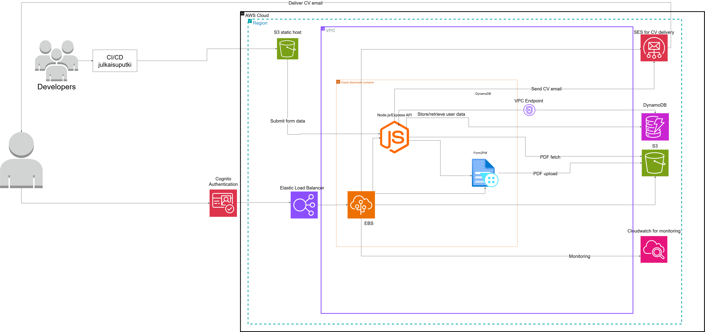
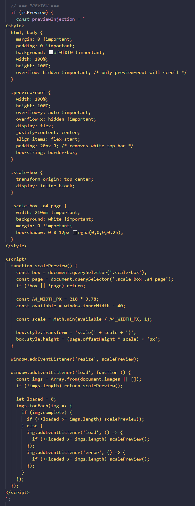
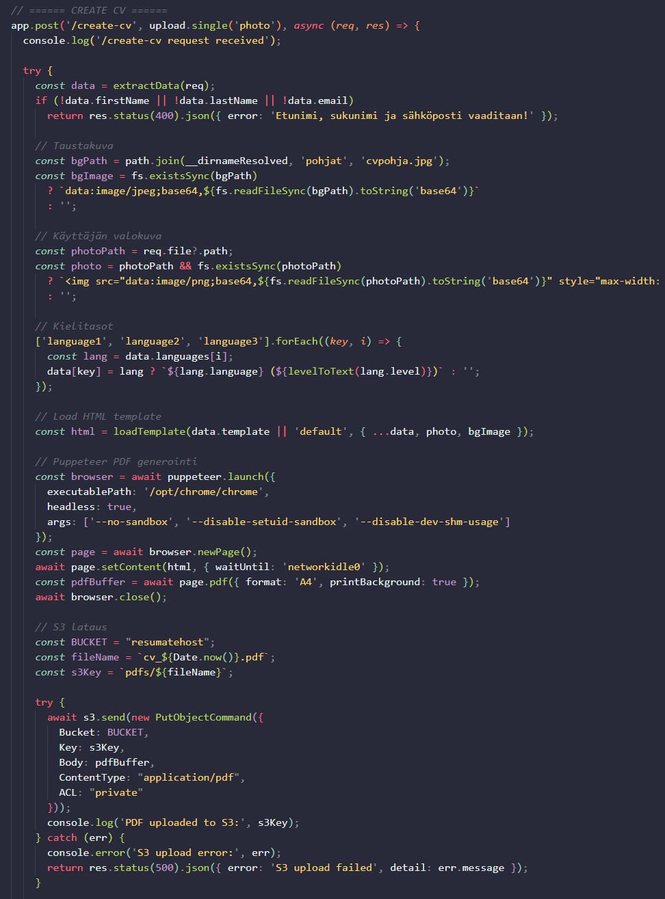

# Resumate

## Introduction
Resumate is a web tool that helps people create resumes easily. The user fills in simple text boxes with their personal information, work experience, and skills. After that, the website creates a ready-to-use resume based on the given information.

The site offers many different resume styles, so users can choose the one they like most or the one that fits the job they are applying for. Resumate makes resume creation faster and easier, especially for people who do not have much experience with design or formatting.

## During the project
During the project, I realized that traditional programming is not the area I enjoy the most. I prefer working with cloud services, infrastructure, and architecture design. This project helped me confirm that cloud technologies are the area where I want to focus in my future career.

One of my main goals was to build a working cloud architecture for the application, and this goal was achieved. I also learned new backend programming skills while working on the project. In addition to technical skills, I improved my teamwork skills by working together with others and solving problems as a team.

## The app

### Infrastructure
Here you can see the AWS architecture diagram and some explanations on the choices.

* S3 static host bucket - Simple and easy way to host a frontend on cloud.
* CloudFront (not in the picture) - CloudFront is added to deliver the website and resume files faster. It also allowed us to make paths for some functions that were not working without them.
* Elastic Beanstalk backend - Between Lambda functions or Elastic Beanstalk it was an easy choice to use Elastic Beanstalk since it handles servers, scaling, load balancing, and deployment.
* AWS Cognito - Manages user accounts. It lets users sign up, log in, and keeps their information safe.

## Start of the project
This project shows my learning process and development during the course. At the beginning of the course, I was able to build cloud architectures with guidance, and I had a basic understanding of backend programming. After completing the project, my cloud skills, especially with AWS, improved significantly, and I became more confident working with cloud-based systems.

The main part of the project is presented through a cloud architecture diagram with clear explanations of the technology choices. This helps show how the application is built and why certain cloud services were selected. The side work of the project is shown through backend code snippets that I had to learn and write so that the application works correctly in the cloud environment.

## Main features
This code creates a preview of the resume on the website.
The resume is shown like an A4 paper inside the browser and it's scaled automatically to fit the screen, so it looks good on all screen sizes.

This code creates a backend API endpoint that generates a CV as a PDF file.
It receives the users data from the input fields, builds it into a resume using an HTML template, converts the template into an A4 PDF with Puppeteer, uploads the PDF to Amazon S3 bucket, and finally returns a CloudFront link where the CV can be downloaded.

Most of the thigns shown here are something I haven't done before or even thought about how to do them and through that I now have a new set of skills to put in use in the future. Setting up the backend was quite difficult since it wouldn't start at first but I figured out while setting up Elastic Beanstalk there was an error in the configuration. After that getting the front- and backend working together in the cloud was much harder than I anticipated but with CloudFront and fixing the code I got it working.

## Overall
###Key achievements

Built a complete cloud-based CV generation system using AWS
Successfully generated and distributed PDFs using Puppeteer, S3, and CloudFront
Designed a scalable cloud architecture

I learned a lot of new things and got to use my existing AWS skills to understand what we need and how to set up the basic infrastructure. In my opinion, this project was a good choice for me to improve my skills in cloud services and overall I am happy with how everything turned out even though there were times where I was having a really hard time. 

### Future
In the future, I see myself working on different projects, but I hope to focus mainly on cloud services rather than traditional programming tasks. My career goal is to work in a role where I can design cloud architectures or work as a cloud consultant.

The course supported these goals well by teaching how to move from an idea to architecture design and implementation. It also helped me understand how to choose the right technologies based on the project needs.

### After school
To reach my goals, I still need to deepen my technical skills, gain more work experience, and complete AWS certifications. My strengths include problem-solving skills, patience, and strong interest in cloud services, especially AWS. These strengths became clearer during the project, as I faced new challenges and enjoyed solving them.

I chose these documents for my portfolio because they best show my work, my learning process, and the challenges I faced while building a cloud-based application.

# V2

# Resumate

## Introduction
Resumate is a web tool that helps people create resumes easily. The user fills in simple text boxes with their personal information, work experience, and skills. After that, the website creates a ready-to-use resume based on the given information.

The site offers many different resume styles, so users can choose the one they like most or the one that fits the job they are applying for. Resumate makes resume creation faster and easier, especially for people who do not have much experience with design or formatting.

---

## During the Project
During the project, I realized that traditional programming is not the area I enjoy the most. I prefer working with cloud services, infrastructure, and architecture design. This project helped me confirm that cloud technologies are the area where I want to focus in my future career.

One of my main goals was to build a working cloud architecture for the application, and this goal was achieved. I also learned new backend programming skills while working on the project. In addition to technical skills, I improved my teamwork skills by working together with others and solving problems as a team.

---

## The App

### Infrastructure
Here you can see the AWS architecture diagram and some explanations on the choices.

- **S3 static host bucket** – Simple and easy way to host a frontend on cloud.  
- **CloudFront (not in the picture)** – CloudFront is added to deliver the website and resume files faster. It also allowed us to make paths for some functions that were not working without them.  
- **Elastic Beanstalk backend** – Between Lambda functions or Elastic Beanstalk it was an easy choice to use Elastic Beanstalk since it handles servers, scaling, load balancing, and deployment.
- **Elastic Load Balancer** - We used Elastic Load Balancer to make sure the app works well and stays fast for all users, even if one server stops or many people use it at the same time.
- **Cognito**

---

### Start of the Project
This project shows my learning process and development during the course. At the beginning of the course, I was able to build cloud architectures with guidance, and I had a basic understanding of backend programming. After completing the project, my cloud skills, especially with AWS, improved significantly, and I became more confident working with cloud-based systems.

The main part of the project is presented through a cloud architecture diagram with clear explanations of the technology choices. This helps show how the application is built and why certain cloud services were selected. The side work of the project is shown through backend code snippets that I had to learn and write so that the application works correctly in the cloud environment.

---

### Main Features
The website can create a preview of the resume. The resume is shown like an A4 paper inside the browser and is scaled automatically to fit the screen, so it looks good on all screen sizes.

The backend API can generate a CV as a PDF file. It receives the user’s data from the input fields, builds it into a resume using an HTML template, converts the template into an A4 PDF with Puppeteer, uploads the PDF to an Amazon S3 bucket, and finally returns a CloudFront link where the CV can be downloaded.

Most of the things shown here are something I hadn't done before or even thought about how to do. Through this, I now have a new set of skills to use in the future. Setting up the backend was quite difficult since it wouldn't start at first, but I figured out that while setting up Elastic Beanstalk there was an error in the configuration. After that, getting the front- and backend working together in the cloud was much harder than I anticipated, but with CloudFront and fixing the code, I got it working.

---

## Overall

### Key Achievements
- Built a complete cloud-based resume generation system using AWS.  
- Successfully generated and distributed PDFs using Puppeteer, S3, and CloudFront.  
- Designed a scalable cloud architecture.

I learned a lot of new things and got to use my existing AWS skills to understand what we need and how to set up the basic infrastructure. In my opinion, this project was a good choice for me to improve my skills in cloud services, and overall I am happy with how everything turned out, even though there were times where I was having a really hard time.

---

### Future
In the future, I see myself working on different projects, but I hope to focus mainly on cloud services rather than traditional programming tasks. My career goal is to work in a role where I can design cloud architectures or work as a cloud consultant.

The course supported these goals well by teaching how to move from an idea to architecture design and implementation. It also helped me understand how to choose the right technologies based on the project needs.

---

### After School
To reach my goals, I still need to deepen my technical skills, gain more work experience, and complete AWS certifications. My strengths include problem-solving skills, patience, and a strong interest in cloud services, especially AWS. These strengths became clearer during the project, as I faced new challenges and enjoyed solving them.

I chose these documents for my portfolio because they best show my work, my learning process, and the challenges I faced while building a cloud-based application.
